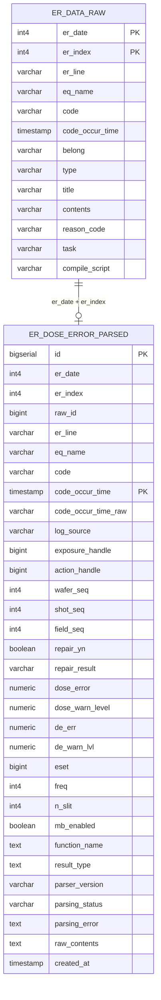

# ER Dose Error Parsing

## 개요

`er_dose`는 PostgreSQL `mbeat.er_data_raw`에 저장된 ER RAW 로그를 읽어 Dose Error 관련 필드를 파싱하고, `mbeat.er_dose_error_parsed`에 정규화해 적재하는 모듈이다.

기존 `ftp_batch`와 분리되어 있으며, 1차 구현 범위는 `dw-xxxx` dose evaluation warning 로그 파싱이다.

## 테이블

DDL은 [create_er_dose_error_parsed.sql](/Users/parkjunho/PycharmProjects/PythonStudy/er_dose/sql/create_er_dose_error_parsed.sql)에 있다.

## ERD



관계 설명:

- `mbeat.er_data_raw`는 원본 ER 로그 저장 테이블이다.
- `mbeat.er_dose_error_parsed`는 분석/조회용 정규화 테이블이다.
- 원본 테이블에는 단일 `id`가 없으므로 `er_date + er_index`를 원본 식별 기준으로 사용한다.
- `raw_id`는 조인 편의와 추적을 위해 `er_date * 1000000000 + er_index`로 만든 파생 키다.
- `code_occur_time`은 파티션 키이므로 parsed 테이블의 PK와 unique 기준에 포함된다.

핵심 정책:

- RAW 원문은 `mbeat.er_data_raw.contents`에 유지한다.
- parsed 테이블에도 `raw_contents`를 저장한다.
- `code_occur_time`은 `TIMESTAMP(6)`이며 파티션 키다.
- 조회, 삭제, 재처리는 반드시 `code_occur_time` 범위 기준으로 수행한다.
- 배치는 실행 범위의 월 파티션을 자동 생성한다.
- 재처리 시 대상 기간의 parsed 데이터를 삭제한 뒤 다시 적재한다.
- 원본 RAW에는 `id`가 없으므로 `er_date`, `er_index`를 함께 저장한다.
- `raw_id`는 `er_date * 1000000000 + er_index`로 만든 파생 추적 키다.
- 운영 가드 unique 기준은 `(er_date, er_index, code_occur_time)`이다.

## 컬럼 설명

원본 추적 컬럼:

- `er_date`, `er_index`: RAW 테이블의 원본 식별자
- `raw_id`: `er_date`, `er_index` 기반 파생 추적 키
- `raw_contents`: 파싱 대상 원문
- `code_occur_time_raw`: microsecond 보존 확인용 문자열 timestamp

분석 기준 컬럼:

- `eq_name`: 설비명
- `code`: ER 코드
- `code_occur_time`: ER 발생 시각, 파티션/조회 기준
- `log_source`: `belong:type` 조합 값
- `exposure_handle`: Shot 식별에 사용하는 handle
- `action_handle`: Action 식별에 사용하는 handle

Dose Error 컬럼:

- `dose_error`: warning 문장의 dose evaluation 값
- `dose_warn_level`: warning 기준값
- `de_err`: 로그 내부 `de_err` 값
- `de_warn_lvl`: 로그 내부 warning level 값
- `eset`, `freq`, `n_slit`, `mb_enabled`: Dose 평가 관련 파라미터
- `function_name`, `result_type`: 로그 마지막 함수/결과 블록

후속 enrichment 컬럼:

- `wafer_seq`, `shot_seq`, `field_seq`: expose handle 순서 기반으로 복원 예정
- `repair_yn`, `repair_result`: Repair/Re-Expose 판정 후 저장 예정

파서 운영 컬럼:

- `parser_version`: 파서 버전, 현재 `v1`
- `parsing_status`: `SUCCESS`, `REGEX_FAIL`, `PARSER_ERROR`
- `parsing_error`: 실패 사유
- `created_at`: parsed row 생성 시각

## 실행

DB 접속은 `--dsn`, `ER_DOSE_DB_DSN`, `DATABASE_URL` 순서로 사용한다.

```bash
python -m er_dose.run_er_dose_batch \
  --start-time 2026-04-13T00:00:00 \
  --end-time 2026-04-14T00:00:00 \
  --limit 1000
```

## 파싱 규칙

대상은 `dw-xxxx` 코드이며, contents 안에 `dose evaluation`, `de_err`, `dwdc_eval_determine_dose_performance_result` 중 하나가 있는 로그다.

추출 필드:

- `exposure_handle`
- `action_handle`
- `dose_error`
- `dose_warn_level`
- `de_err`
- `de_warn_lvl`
- `eset`
- `freq`
- `n_slit`
- `mb_enabled`
- `function_name`
- `result_type`

필드가 없으면 nullable 컬럼은 `NULL`로 저장한다.

파싱 상태:

- `SUCCESS`: parser가 dose error 필드를 정상 추출한 row
- `REGEX_FAIL`: 후보 로그지만 현재 parser가 매칭하지 못한 row
- `PARSER_ERROR`: 파싱 중 예외가 발생한 row

`wafer_seq`, `shot_seq`, `field_seq`, `repair_yn`, `repair_result`는 1차 구현에서는 nullable로 두고 후속 enrichment에서 채운다.

## 현재 범위 밖

- `kd-xxxx`, `er-xxxx`, `pl-xxxx` 전용 파서
- Scanner ER / Source ER ±5분 매칭
- Shot sequence 복원
- Wafer summary
- Repair / Re-Expose 판정
- Root Cause / Yield 분석용 집계 테이블
