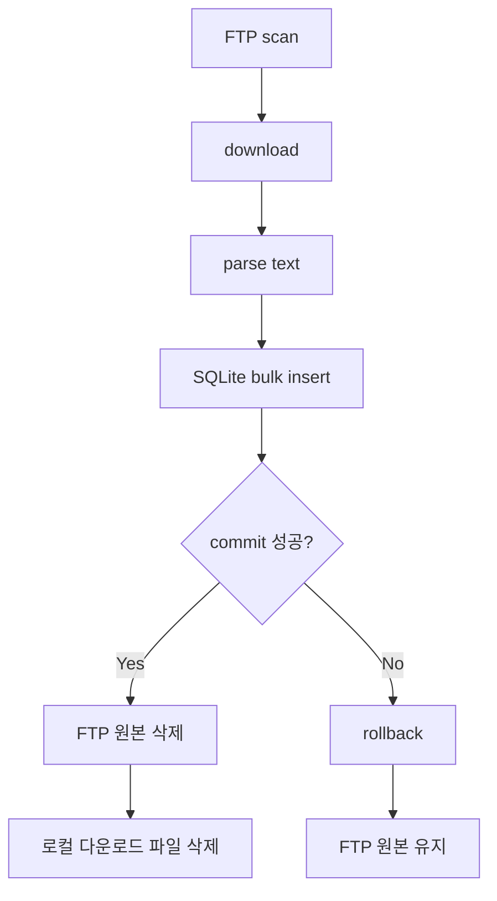

# FTP Batch Pipeline

## 프로젝트 개요

이 프로젝트는 FTP 서버에 주기적으로 생성되는 파일을 수집해서 처리하는 배치입니다.

- `RUBI`: 텍스트 파일을 다운로드해서 파싱한 뒤 DB에 저장합니다.
- `RUPI`: 이미지 파일을 텍스트와 매칭한 뒤 로컬에서 PNG로 변환하고, 마지막에 서버 FTP로 일괄 업로드합니다.

현재 구현의 중심은 `RUBI` 파이프라인입니다. `RUPI`도 동작하지만, 정합성 보강 포인트가 더 남아 있습니다.

## 디렉토리 구조

```text
ftp_batch/
├── app/
│   └── batch_runner.py
├── common/
│   ├── date_utils.py
│   └── path_utils.py
├── config/
│   └── local_test_settings.py
├── infra/
│   ├── db_manager.py
│   └── ftp_scanner.py
├── matching/
│   └── image_text_matcher.py
└── processors/
    ├── rubi_processor.py
    └── rupi_processor.py

test.py
init_db.py
local_ftp_server.py
README.md
IMAGE_TEXT_MATCHING.md
```

- `ftp_batch/app`: 배치 실행 흐름
- `ftp_batch/common`: 날짜/경로 helper
- `ftp_batch/config`: 로컬/FTP 설정
- `ftp_batch/infra`: FTP, DB 공통 계층
- `ftp_batch/matching`: 이미지-텍스트 매칭 로직
- `ftp_batch/processors`: `RUBI`, `RUPI` 도메인 처리
- 루트 스크립트: 실행 진입점과 초기화 도구

## 현재 구현

### RUBI 처리 흐름



- 입력 날짜를 anchor로 받고, 전날과 anchor 날짜 폴더를 함께 조회합니다.
- 원본 파일을 로컬 작업 폴더로 다운로드합니다.
- 텍스트를 파싱합니다.
- `pandas.DataFrame`으로 정리한 뒤 공통 DB 계층의 벌크 인설트로 저장합니다.
- commit 성공 시에만 FTP 원본 파일을 삭제합니다.
- 실패 시 rollback 하고 원본은 그대로 둡니다.

### RUPI 처리 흐름

- 입력 날짜를 anchor로 받고, 전날과 anchor 날짜 폴더를 함께 조회합니다.
- 같은 날짜의 `RUBI` 텍스트 후보를 FTP에서 같이 조회합니다.
- 이미지 파일명을 기준으로 `prefix 동일`, `text_ts >= image_ts`, `5분 이내` 조건의 가장 가까운 텍스트를 찾습니다.
- 이미지는 먼저 SQLite `rupi_ingest`에 insert 합니다.
- 매칭 실패 시 방금 insert 한 이미지 row 를 delete 합니다.
- 서버 FTP에 `rbi/ruip/.../*.png` 결과가 이미 있으면 업로드 큐에 넣지 않고 DB 정보만 갱신합니다.
- 서버 결과가 없고 로컬 PNG가 이미 있으면 원본 TIF를 다시 받지 않고 업로드 큐에만 추가합니다.
- 서버 결과도 없고 로컬 PNG도 없을 때만 원본 TIF를 로컬로 다운로드합니다.
- 다운로드한 TIF를 로컬에서 PNG로 변환하고 업로드 큐에 추가합니다.
- 이미지 준비가 끝난 뒤 업로드 큐를 마지막에 한 번에 순차 업로드합니다.
- 업로드 시 원격 크기와 로컬 크기를 비교해 검증합니다.
- 업로드 성공 후 로컬 TIF는 삭제하고, 로컬 PNG는 재업로드 캐시로 유지합니다.
- 업로드 성공 항목만 결과 PNG 경로까지 최종 update 합니다.

## 주요 클래스 역할

### `FTPScanner`

위치: [/Users/parkjunho/PycharmProjects/PythonStudy/ftp_batch/infra/ftp_scanner.py](/Users/parkjunho/PycharmProjects/PythonStudy/ftp_batch/infra/ftp_scanner.py)

역할:

- 날짜 폴더 조회
- 원격 파일 다운로드
- 원격 파일 업로드
- 원격 파일 존재 여부 확인
- 원격 파일 크기 확인
- 원격 파일 삭제

현재 `download_file()`은 공통 다운로드 검증을 사용합니다.

- `FTP SIZE`로 원격 크기 조회
- 실제 받은 바이트 수 추적
- 크기가 다르면 예외 발생
- 실패 시 불완전 로컬 파일 삭제

현재 `upload_file()`도 업로드 후 공통 검증을 사용합니다.

- 업로드 후 원격 크기 조회
- 로컬 파일 크기와 비교
- 크기가 다르면 예외 발생

### `RubiProcessor`

위치: [/Users/parkjunho/PycharmProjects/PythonStudy/ftp_batch/processors/rubi_processor.py](/Users/parkjunho/PycharmProjects/PythonStudy/ftp_batch/processors/rubi_processor.py)

역할:

- 로컬 텍스트 파일 읽기
- `utf-8`, `cp949`, `errors=replace` 순서로 디코딩
- 텍스트 파싱
- `pandas.DataFrame` 생성
- 공통 DB 계층으로 insert

현재 파싱 규칙:

- `key=value`
- `a,b,c` 같은 csv 유사 라인
- 그 외 raw line

DB 적재는 현재 [db_manager.py](/Users/parkjunho/PycharmProjects/PythonStudy/ftp_batch/infra/db_manager.py) 의 `DataFrame -> sqlite3.executemany` 기반 공통 벌크 인설트를 사용합니다.

### `DBManager`

위치: [/Users/parkjunho/PycharmProjects/PythonStudy/ftp_batch/infra/db_manager.py](/Users/parkjunho/PycharmProjects/PythonStudy/ftp_batch/infra/db_manager.py)

역할:

- 공통 SQLite 연결 관리
- `pandas.read_sql_query` 기반 조회
- `DataFrame -> executemany` 기반 벌크 인설트
- 공통 execute
- 테이블 존재 확인

### `RupiProcessor`

위치: [/Users/parkjunho/PycharmProjects/PythonStudy/ftp_batch/processors/rupi_processor.py](/Users/parkjunho/PycharmProjects/PythonStudy/ftp_batch/processors/rupi_processor.py)

역할:

- SQLite `rupi_ingest` 테이블 관리
- 이미지 메타 insert / delete / 매칭 후보 update / 업로드 완료 확정 update
- 로컬 이미지 파일 열기
- 해상도 축소
- PNG 저장

이미지 처리는 `Pillow`를 사용합니다.

### `image_text_matcher`

위치: [/Users/parkjunho/PycharmProjects/PythonStudy/ftp_batch/matching/image_text_matcher.py](/Users/parkjunho/PycharmProjects/PythonStudy/ftp_batch/matching/image_text_matcher.py)

역할:

- 파일명에서 `prefix`, timestamp 추출
- 같은 날짜의 텍스트 후보 중 가장 가까운 텍스트 선택
- 매칭 조건 `prefix 동일`, `text_ts >= image_ts`, `5분 이내` 적용
- `RUIP` 원격 경로를 `rbi/ruip/.../*.png` 업로드 경로로 변환

### `BatchRunner`

위치: [/Users/parkjunho/PycharmProjects/PythonStudy/ftp_batch/app/batch_runner.py](/Users/parkjunho/PycharmProjects/PythonStudy/ftp_batch/app/batch_runner.py)

역할:

- 날짜/파서 입력 정규화
- FTP scanner 생성
- 파일별 처리 순서 제어
- `RUBI`와 `RUPI` 분기
- `RUPI`의 준비 단계와 마지막 업로드 단계 제어
- 성공/실패 로그 출력

## 실행 방법

### 1. 로컬 FTP 서버 실행

[/Users/parkjunho/PycharmProjects/PythonStudy/local_ftp_server.py](/Users/parkjunho/PycharmProjects/PythonStudy/local_ftp_server.py)

```bash
/Users/parkjunho/PycharmProjects/PythonStudy/.venv/bin/python \
  /Users/parkjunho/PycharmProjects/PythonStudy/local_ftp_server.py
```

### 2. 배치 실행

[/Users/parkjunho/PycharmProjects/PythonStudy/test.py](/Users/parkjunho/PycharmProjects/PythonStudy/test.py)

`RUBI`

```bash
/Users/parkjunho/PycharmProjects/PythonStudy/.venv/bin/python \
  /Users/parkjunho/PycharmProjects/PythonStudy/test.py \
  --input-date 2026-03-25 \
  --parser RUBI
```

`RUPI`

```bash
/Users/parkjunho/PycharmProjects/PythonStudy/.venv/bin/python \
  /Users/parkjunho/PycharmProjects/PythonStudy/test.py \
  --input-date 2026-03-25 \
  --parser RUPI
```

### 3. DB 테이블 초기화

테이블 생성은 처리 코드에서 자동으로 하지 않습니다. 한 번만 아래 스크립트를 실행합니다.

[/Users/parkjunho/PycharmProjects/PythonStudy/init_db.py](/Users/parkjunho/PycharmProjects/PythonStudy/init_db.py)

```bash
/Users/parkjunho/PycharmProjects/PythonStudy/.venv/bin/python \
  /Users/parkjunho/PycharmProjects/PythonStudy/init_db.py
```

## 현재 설정

위치: [/Users/parkjunho/PycharmProjects/PythonStudy/ftp_batch/config/local_test_settings.py](/Users/parkjunho/PycharmProjects/PythonStudy/ftp_batch/config/local_test_settings.py)

주요 값:

- `CLIENT_FTP_*`: 원본 파일 FTP
- `TEXT_FTP_ROOT_PATH = "/RUBI"`
- `SERVER_FTP_*`: 결과 파일 FTP
- `CLIENT_FTP_ROOT_PATH = "/RUIP"`
- `SERVER_FTP_ROOT_PATH = "/rbi"`
- `LOCAL_WORK_DIR`: 로컬 작업 폴더
- `LOCAL_DB_PATH`: 현재 SQLite DB 파일
- `RUPI_SCALE_PERCENT`: 이미지 축소 비율

현재 로컬 테스트에서는 `CLIENT_FTP`와 `SERVER_FTP`가 같은 로컬 FTP 서버를 바라보지만, 경로는 다르게 사용합니다.

## 데이터 정합성 / 실패 정책

### 현재 구현

#### RUBI

- DB commit 성공 전에는 FTP 원본을 삭제하지 않습니다.
- 파싱 또는 DB 적재 중 오류가 나면 rollback 합니다.
- rollback 시 FTP 원본은 유지됩니다.
- 실패한 로컬 다운로드 파일은 삭제해서 다음 실행에서 다시 다운로드하도록 합니다.

#### RUPI

- 이미지를 먼저 SQLite `rupi_ingest`에 insert 합니다.
- 같은 날짜의 `RUBI` 텍스트 후보를 FTP에서 읽어 매칭합니다.
- 매칭 실패 시 방금 insert 한 row 는 delete 합니다.
- 서버 FTP에 `rbi/ruip/.../*.png` 결과가 있으면 업로드 큐에 넣지 않고 DB 매칭 정보만 유지합니다.
- 서버 결과가 없고 로컬 PNG가 있으면 재변환 없이 업로드 큐에 넣습니다.
- 서버 결과도 없고 로컬 PNG도 없을 때만 원본 TIF를 다시 다운로드합니다.
- 이미지 준비가 끝난 뒤 마지막에 한 번에 업로드합니다.
- 업로드 성공 후 로컬 TIF는 삭제하고, 로컬 PNG는 다음 실행의 재업로드 캐시로 유지합니다.
- 업로드 실패 시 로컬 PNG는 유지되므로 다음 실행에서 재업로드를 다시 시도할 수 있습니다.

### 현재 남아 있는 운영 리스크

- `RUBI`에서 DB commit은 성공했는데 FTP 원본 삭제가 실패하면, 다음 실행 때 같은 파일이 다시 잡혀 중복 적재될 수 있습니다.
- 현재 구현에는 이 상황을 막는 별도 상태 저장소나 delete-failed 재시도 큐가 없습니다.

## FTP / 로컬 경로 원칙

- FTP 경로는 문자열로 다룹니다.
- 로컬 경로는 `Path` 객체로 다룹니다.

예:

- FTP: `"/RUBI/20260325/sample.txt"`
- 로컬: `Path("/tmp/ftp_work/20260325/sample.txt")`

현재 `scan()` 동작:

- 기준 경로는 `root_path/YYYYMMDD`
- 재귀가 아니라 날짜 폴더 바로 아래의 파일만 수집합니다.

즉 현재 구현은 `parser/date` 재귀 스캔 구조가 아니라, 각 parser별 root를 설정으로 나누고 그 아래 날짜 폴더만 직접 조회하는 구조입니다.

## 현재 구현 한계와 다음 작업 포인트

### 현재 구현

- `RUBI` DB는 SQLite 기반입니다.
- query는 공통 `DBManager`에서 `pandas`로 처리하고, insert는 공통 벌크 인설트로 처리합니다.
- `RUPI` 이미지 메타도 SQLite `rupi_ingest` 테이블에 저장합니다.
- 공통 `DBManager`는 SQLite 기준으로 분리되어 있습니다.
- `RUPI`와 `RUBI`가 같은 러너에서 분기됩니다.
- 테이블 생성은 런타임 처리 코드가 아니라 별도 초기화 스크립트에서 수행합니다.

### 향후 개선 포인트

- PostgreSQL 기반 `DBManager` 분리
- `RUBI` bulk insert를 `psycopg2.execute_values`로 전환
- `commit 성공 후 delete 실패` 재시도 정책 추가
- `RUPI` 업로드 정합성 보강
- 필요 시 `scan()` 재귀 스캔 지원
- 이미지-텍스트 매칭 로직 고도화

관련 설계 문서:

- [IMAGE_TEXT_MATCHING.md](/Users/parkjunho/PycharmProjects/PythonStudy/IMAGE_TEXT_MATCHING.md)

## 요약

현재 프로젝트는 다음 기준으로 이해하면 됩니다.

- `RUBI`
  - 다운로드
  - 파싱
  - DB bulk insert
  - commit 성공 시 FTP 원본 삭제
- `RUPI`
  - 전날 + 오늘 스캔
  - 이미지-텍스트 매칭
  - 로컬 PNG 변환
  - `rbi/ruip/...` 서버 FTP 업로드

즉 현재 구현의 핵심은 `RUBI` 파이프라인의 정합성을 맞추는 것이고, 상태 파일 기반 중복 판단보다 `commit 성공 후 삭제`를 기준으로 단순화한 구조입니다.
