# Database Tables

배치 프로그램은 런타임에서 테이블을 자동 생성하지 않는다.

즉 아래 테이블은 DB에 사전에 만들어져 있어야 한다.

## 1. `file_processing_history`

파일 처리 이력 테이블이다.

역할:

- 중복 처리 방지
- 재실행 안전성 보장
- `DONE`, `FAIL`, `PROCESSING` 상태 관리
- Rubi/Rubp 모두 확장 가능

### 컬럼

| 컬럼명 | 타입 | NULL | 설명 |
|---|---|---|---|
| `id` | `bigserial` | `NOT NULL` | PK |
| `source_type` | `text` | `NOT NULL` | 소스 종류. 예: `RUBI_TXT`, `RUBP_TIF` |
| `file_name` | `text` | `NOT NULL` | 파일명 |
| `file_path` | `text` | `NOT NULL` | 원격 전체 경로 |
| `file_datetime` | `timestamptz` | `NOT NULL` | 파일명에서 파싱한 업무 기준 시각 |
| `status` | `text` | `NOT NULL` | `PROCESSING`, `DONE`, `FAIL` |
| `error_message` | `text` | `NULL` | 실패 메시지 |
| `processed_at` | `timestamptz` | `NULL` | 성공 완료 시각 |
| `created_at` | `timestamptz` | `NOT NULL` | 생성 시각 |
| `updated_at` | `timestamptz` | `NOT NULL` | 마지막 갱신 시각 |

### 제약 조건

- PK: `id`
- UNIQUE: `(source_type, file_name)`
- CHECK: `status in ('PROCESSING', 'DONE', 'FAIL')`

### 인덱스

- `idx_file_processing_history_status`
- `idx_file_processing_history_file_datetime`

### 설계 메모

- 현재는 `source_type + file_name`을 유니크 키로 사용한다.
- 파일명에 업무 기준 datetime이 포함되어 있고 현재 피드에서는 파일명이 사실상 고유 키 역할을 한다.
- 만약 같은 파일명이 다른 경로에 반복될 수 있는 피드라면 `(source_type, file_path, file_name)`로 강화하는 것이 안전하다.

## 2. `rubi_parsed_data`

Rubi txt 파싱 결과 적재 테이블이다.

역할:

- txt 한 파일에서 나온 파싱 결과를 JSONB 형태로 저장
- 한 파일 안의 여러 줄/레코드를 `record_index`로 구분
- 재처리 시 `ON CONFLICT`로 upsert

### 컬럼

| 컬럼명 | 타입 | NULL | 설명 |
|---|---|---|---|
| `id` | `bigserial` | `NOT NULL` | PK |
| `history_id` | `bigint` | `NOT NULL` | `file_processing_history.id` FK |
| `record_index` | `integer` | `NOT NULL` | 파일 내 레코드 순번 |
| `parsed_payload` | `jsonb` | `NOT NULL` | 파싱 결과 JSON |
| `created_at` | `timestamptz` | `NOT NULL` | 생성 시각 |
| `updated_at` | `timestamptz` | `NOT NULL` | 마지막 갱신 시각 |

### 제약 조건

- PK: `id`
- FK: `history_id -> file_processing_history.id`
- UNIQUE: `(history_id, record_index)`

## 관계

```mermaid
erDiagram
    file_processing_history ||--o{ rubi_parsed_data : has

    file_processing_history {
        bigint id PK
        text source_type
        text file_name
        text file_path
        timestamptz file_datetime
        text status
        text error_message
        timestamptz processed_at
        timestamptz created_at
        timestamptz updated_at
    }

    rubi_parsed_data {
        bigint id PK
        bigint history_id FK
        integer record_index
        jsonb parsed_payload
        timestamptz created_at
        timestamptz updated_at
    }
```



## 상태값 의미

| 상태값 | 의미 |
|---|---|
| `PROCESSING` | 현재 처리 중이거나 비정상 종료 후 남아 있는 상태 |
| `DONE` | 성공적으로 처리 완료 |
| `FAIL` | 처리 실패. 재처리 대상 |

## 생성 SQL

```sql
create table if not exists file_processing_history (
    id bigserial primary key,
    source_type text not null,
    file_name text not null,
    file_path text not null,
    file_datetime timestamptz not null,
    status text not null check (status in ('PROCESSING', 'DONE', 'FAIL')),
    error_message text,
    processed_at timestamptz,
    created_at timestamptz not null default now(),
    updated_at timestamptz not null default now(),
    unique (source_type, file_name)
);

create index if not exists idx_file_processing_history_status
    on file_processing_history (status);

create index if not exists idx_file_processing_history_file_datetime
    on file_processing_history (file_datetime);

create table if not exists rubi_parsed_data (
    id bigserial primary key,
    history_id bigint not null references file_processing_history(id) on delete cascade,
    record_index integer not null,
    parsed_payload jsonb not null,
    created_at timestamptz not null default now(),
    updated_at timestamptz not null default now(),
    unique (history_id, record_index)
);
```
